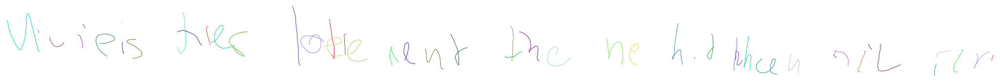

## Generating handwriting with LSTM, Mixture Gaussian & Bernoulli distribution and PyTorch 

This is a PyTorch implementation of *[Generating Sequences With Recurrent Neural Networks](https://arxiv.org/abs/1308.0850)* by Alex Graves.

This code is based on *[rnn-handwriting-generation](https://github.com/snowkylin/rnn-handwriting-generation)*. Many thanks for the authors!

This repo only implements one function:

* **Handwriting Prediction**: Randomly generate a line of handwriting (set `mode=predict`). 

### How to Use
1. Extract `lineStrokes-all.tar.gz` and `ascii-all.tar.gz` to the directory `./data`. You can refer to `download.sh` for more informations
2. Train the model, which will be saved as `data/pkl/model_<epoch_index>.pkl`
```
python train.py
```
3. Sample results
```
python sample.py --load_path=data/pkl/model_25.pkl
```
4. The sampled result is saved as SVG file named as `sample.normal.svg`

### Sample Result

#### Handwriting Prediction


This is the result with default setting:
* rnn state size = 256
* rnn length = 300
* num of layers = 2
* number of mixture gaussian = 20
* epochs: 25
